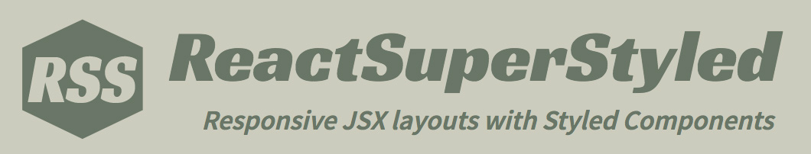

React Super Styled
==================



[](https://github.com/styled-components/styled-components)
[](http://https://prettier.io/)


### Responsive JSX layouts with Styled Components

A collection of semantic React "layout components" for working with [Styled Components](https://www.styled-components.com/).

* Semantic component and prop naming
* Handy boolean props for common styling rules
* Flexbox and flex-based 12-column grid
* Media breakpoint props for styles, grid, and display (show/hide)
* Extensible theme vars
* Spacing "shorthands" for margin, padding

Caveats:
1) Not a full-fledged styling "framework"
2) Dynamic prop parsing adds some overhead
3) Untested server-side


### Installation
```
npm install react-super-styled --save
```
or
```
yarn add react-super-styled
```

Your React project should be using Styled Components as a dependency. If not, [install it](https://www.styled-components.com/docs/basics#installation).


### Usage Example
```
import { Article, Heading, Text } from 'react-super-styled'

function MyArticle({text, title}) {
  return (
    <Article margin="1 *" mdStyles="padding: 10px">
      <Heading h3 center color="firebrick" large>{title}</Heading>
      <Text italic">{text}</Text>
    </Article>
  )
}
```

### Interactive Docs
Try out *React Super Styled* "live" in the [DEMO](https://moarwick.github.io/react-super-styled/). This README may be sparse but the intent behind *RSS* is to be intuitive and readable. Experiment with all listed props and inspect the results! :)


### Theme
*RSS* components rely on a built-in [default theme](https://github.com/moarwick/react-super-styled/blob/master/src/lib/THEME.js). Being a layout-oriented library, its theme avoids concerning itself with colors or other design-oriented values (except for font weights & sizing, to enable some handy typography controls).

You can pass in your own theme (or a subset thereof) to any *RSS* component directly via the `theme` prop, or using Styled Components' `ThemeProvider` [wrapper](https://www.styled-components.com/docs/advanced#theming). The passed in theme will be "extended over" the defaults, so it can be used to override existing values or to add more variables in case you decide to [extend](#extending-styling) any *RSS* components further.

### Responsive Styles
All *RSS* components accept styling props per each media breakpoint: `styles`, `smStyles`, `mdStyles`, `lgStyles` and `xlStyles`. It's a "mobile-first" approach, so think of it in that order -- use `styles` as the default style, which applies from the smallest width (akin to "xs" in Bootstrap); then pass in additional styling into any of the other style props to trigger when those breakpoints are exceeded.

Styles can be passed in as a basic string of CSS, e.g. `color: red; font-size: 32px` or an array of CSS interpolations from Styled Components' `css` helper. Have a look at the demo [source code](https://github.com/moarwick/react-super-styled/blob/master/src/ComponentDemo.js) for usage examples.

### Extending Styling
Majority of *RSS* components are functional native Styled Components, so alternatively, they can be extended via Styled Components' [extend method](https://www.styled-components.com/docs/basics#extending-styles). The exceptions currently are `Heading` and `Flex` which would need to use the `styled(Comp)` approach.

*NOTE: RSS is intended for building layouts, However, there is some overhead in parsing all the props, so you should probably create "raw" styled components whenever building actual UI widgets or more custom or complex components.*

### Grid
The `Flex` (container) and `FlexItem` components support all valid Flexbox props, plus a 12-column grid implementation, including media-based columns, offsets, and gutters. As with styles, the responsive grid props are applied in the "mobile-first" order.

Since gutters are optional, negative margins are applied to a `Flex` (row) only if gutter props are present. While `FlexItem` supports gutter props, they should be specified at the `Flex` row level (and will be passed down automatically to all direct `FlexItem` children). See the [DEMO](https://moarwick.github.io/react-super-styled/) for examples.

### Spacing Shorthands
Since web layouts involve frequent tweaking of margins and padding, most *RSS* components accept "shorthand" `margin` and `padding` props. The standard CSS syntax is enhanced to interpret pure numbers as "multipliers" of the `THEME.SPACER` (10px), and asterisks `*` to skip a given direction altogether.

For instance, `padding="1"` will result in `padding: 10px;` all around, while `margin="0 2 * *"` will result in `margin-top: 0; margin-right: 20px;`. You can mix the units, e.g. `padding="3 15px * *"` would result in `padding-top: 30px; padding-right: 15px`, but.. maybe keep it consistent? ;)

### Utilities

#### withMedia( [userTheme:Object] )( Component ) ⇒ <code>'xs'|'sm'|'md'|'lg'|'xl'</code>
Component enhancer to supply the current "breakpoint" via prop `media`. Uses the `MEDIA_XS, MEDIA_SM, MEDIA_MD, MEDIA_LG` thresholds in [RSS theme](https://github.com/moarwick/react-super-styled/blob/master/src/lib/THEME.js) to determine the breakpoint -- the `userTheme` argument is optional, supply only if [customizing](https://github.com/moarwick/react-super-styled#theme) those theme attributes. Typically, just: `export default withMedia()(MyComponent)`.

### Changelog
* See [Releases](https://github.com/moarwick/react-super-styled/releases)
